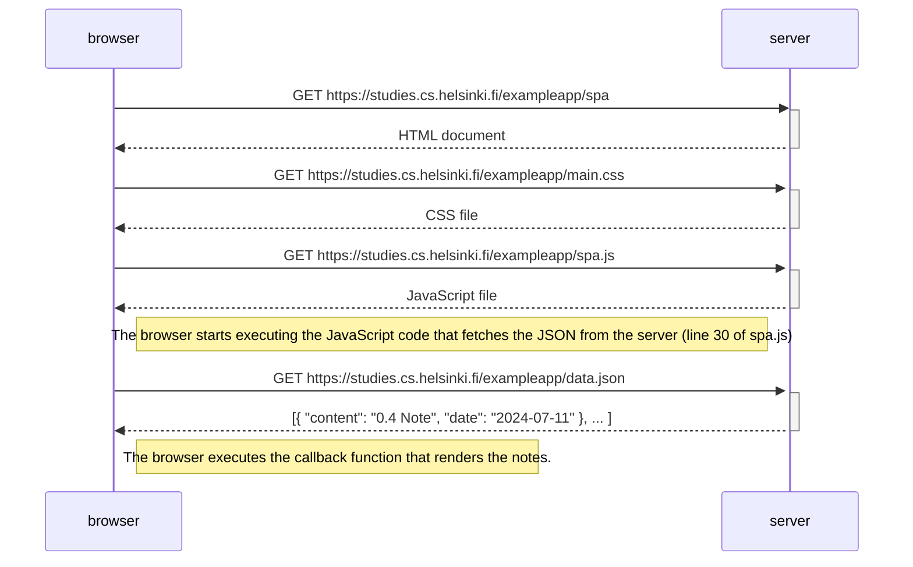

0.5: Diagrama de aplicación de una sola página
Crea un diagrama que describa la situación en la que el usuario accede a la versión de aplicación de una sola página de la aplicación de notas en https://studies.cs.helsinki.fi/exampleapp/spa.

